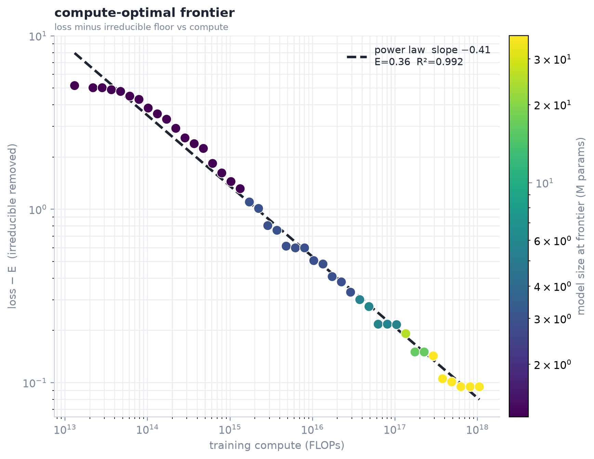
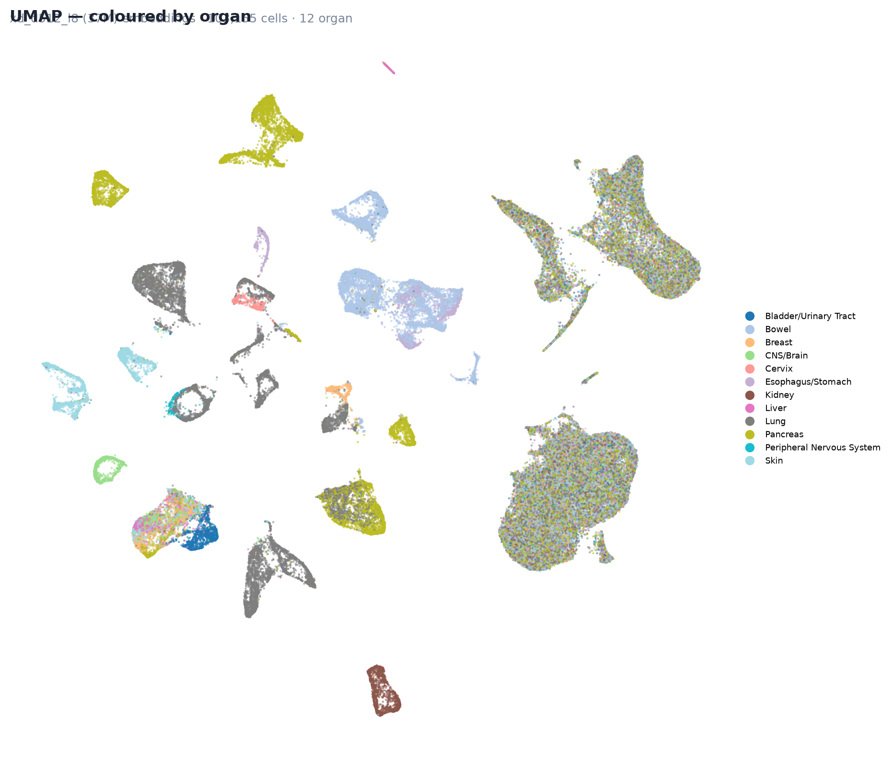

<h1 align="center">🧬 Single-Cell JEPA — Tahoe-100M / Hepatotoxicity</h1>

<p align="center">
  <i>A self-supervised <b>LeJEPA</b> encoder of drug-induced perturbations in (cancer) cells,
  with a compute scaling-law study — built on the <a href="#built-on-eb-jepa">EB-JEPA</a> library.</i>
</p>

<p align="center">
  
  
</p>

---

## What this is

This repository trains a **Joint-Embedding Predictive Architecture** on the public
**[Tahoe-100M](https://huggingface.co/datasets/tahoebio/Tahoe-100M)** dataset (~95.6M
drug-perturbed single cells, 50 cancer cell lines, 379 drugs, 62,710-gene vocabulary).
A gene is a **token**; the encoder maps a cell's transcriptome to a latent state, trained
**label-free** with the LeJEPA objective. The long-term goal is to assess **hepatotoxicity**
(liver-specialized encoder + a perturbator of drug effects). The full living spec is in
[`CLAUDE.md`](CLAUDE.md).

## Changes vs. the original EB-JEPA repo

The upstream repo is a general JEPA library for **images / video / world-models**. This fork
repurposes it into a **single-cell biology** project and adds, on top of the original code:

- **LeJEPA loss** — a `SIGReg` (sliced Epps–Pulley Gaussianity test) + centroid-invariance
  loss faithful to the official `galilai-group/lejepa` `MINIMAL.md`, with multi-GPU ECF
  all-reduce (`eb_jepa/losses.py`).
- **Single-cell encoder** — a set-transformer (no positional encoding; RMSNorm / SwiGLU /
  GQA) over gene tokens, where each token embedding sums **frozen ESMC (protein) + Evo 2
  (DNA) + count** embeddings (`eb_jepa/singlecell/`).
- **`sub14` — the winning recipe** — a faithful port of *Subliminal 1.4*: sigmoid attention,
  per-cell quantile-**thermometer** counts, **Muon+AdamW**, pairwise-cosine JEPA + SIGReg
  (`eb_jepa/singlecell/sub14/`). Far outperforms the baseline encoder (cell-line probe ≈0.92).
- **Tahoe data pipeline** — streaming reader, CP10k+log1p normalization, on-the-fly view
  construction, group-level splits, pathway tokens (`eb_jepa/datasets/tahoe/`).
- **Compute scaling laws** — FLOP/param logging, a multi-GPU job-queue sweep over 12 model
  sizes (1M→186M params, ~10¹⁵→10¹⁸ FLOPs), and publication-grade figures
  (`scripts/run_sub14_*.sh`, `scripts/fit_sub14_*.py`, `visualizations/`).
- **Baselines & probes** — MAE / VAE / PCA baselines and closed-form (RidgeCV) probes for
  organ / cell-line / drug / MoA / pathway targets (`eb_jepa/singlecell/{baselines,probes}.py`).
- **Perturbator scaffold** — frozen-encoder drug-effect predictor with optimal-transport
  (sliced-Wasserstein) matching per `(cell_line, plate)` (`eb_jepa/singlecell/perturbator/`).

## Project layout

```
eb_jepa/
  losses.py                       # SIGReg + LeJEPALoss (added)
  singlecell/
    encoder.py  embeddings.py  layers.py   # set-transformer + gene-token embeddings
    probes.py   baselines.py   visualize.py
    sub14/                        # Subliminal-1.4 recipe (winning encoder)
    perturbator/                  # drug-effect predictor (scaffold)
  datasets/tahoe/                 # streaming dataset, normalizer, preprocess, pathways
examples/tahoe_jepa/
  main.py        # LeJEPA encoder (spec-faithful, DDP)
  sub14_main.py  # sub14 recipe trainer + FLOP/probe logging
  eval_tsne.py  probe_eval.py  cfgs/
scripts/         # gene-emb cache, scaling sweeps + fits, UMAP
visualizations/  # scaling-law figures + UMAPs
tests/00_unit/   # SIGReg, encoder, dataset, sub14, probes, …
```

## Setup

```bash
uv sync                                   # create .venv from pyproject (uv)
uv run pytest tests/00_unit               # sanity-check the added components
```

Frozen **ESMC + Evo 2** gene embeddings are precomputed once and cached (indexed by
`token_id → ensembl_id`); fetch the public cache with:

```bash
python scripts/fetch_gene_embeddings.py --out /data/gene_emb_cache
```

## Key commands

**Train the `sub14` encoder (winning recipe, single-GPU streaming):**
```bash
python -m examples.tahoe_jepa.sub14_main run \
    --config examples/tahoe_jepa/cfgs/sub14_small.yaml
# override anything from the CLI, e.g. a bigger model:
#   --model.d_model 512 --model.n_layers 8 --model.n_heads 8 --model.d_ff 2048
```

**Train the spec-faithful LeJEPA encoder (multi-GPU DDP):**
```bash
torchrun --nproc_per_node=8 -m examples.tahoe_jepa.main run \
    --config examples/tahoe_jepa/cfgs/train.yaml
```

**Run the compute scaling-law sweep** (8-GPU dynamic job-queue, one model size per GPU,
each with its own compute budget + warmup/cosine LR):
```bash
bash scripts/run_sub14_scaling.sh         # 16 runs, ~1→650 PFLOP
bash scripts/run_sub14_expand.sh          # +22 runs: fill size gaps + extend to ~1 EFLOP
```

**Fit + plot the scaling laws** (pull the `sub14_law` W&B group, no retraining):
```bash
python scripts/fit_sub14_scaling.py       # loss-vs-compute frontier + power-law fit
python scripts/fit_sub14_extra.py         # IsoFLOP, data scaling, iso-architecture
python scripts/fit_sub14_frontier.py      # standalone frontier, colored by model size
python scripts/fit_sub14_panels.py        # loss-vs-compute + downstream-probe frontier
```

**Visualize a trained encoder** (encode the whole cached dataset → UMAP, colored by
organ / cell-line / MoA / treatment / plate / drug):
```bash
python scripts/umap_embed.py \
    --ckpt /path/to/encoder_final.pt --out visualizations/umap/xd
```

## Results (scaling laws)

A 42-run sweep over 12 architectures (1M→186M params) yields clean power laws:

- **Loss vs compute** (compute-optimal frontier): `L(C) = E + A·C^(−0.32…0.41)`, **R² ≈ 0.99**.
- **IsoFLOP**: the compute-optimal model size grows with compute (`N_opt ∝ C^0.66`); the
  sweet spot at the explored budgets is ~25–37M params.
- **Data scaling**: `L(D) = E + A·D^(−0.57)` (D = cells seen), R² ≈ 0.98.
- **Downstream**: the cell-line probe **scales with compute up to ≈0.81–0.87** balanced
  accuracy (logistic fit) — evidence *for* scaling in single-cell encoders.

Figures live in [`visualizations/`](visualizations/) (`sub14_scaling_*.png/.pdf`) and the
per-checkpoint UMAPs in [`visualizations/umap/`](visualizations/umap/).

## Cluster notes

Runs target a single 8×B200 node (data + caches under `/data`). On the IDRIS **Dalia**
(GB200, aarch64) cluster, build the venv on a compute node and use `--reservation=Vivatech`;
see [`CLAUDE.md`](CLAUDE.md) → *Cluster access* for the exact SLURM invocation and storage
layout.

---

## Built on EB-JEPA

This project is a fork of the **EB-JEPA** library (Energy-Based Joint-Embedding Predictive
Architectures, Meta AI / FAIR). The original image/video/world-model examples and the core
training utilities are retained. If you use this code, please also cite the upstream work:

```bibtex
@misc{terver2026lightweightlibraryenergybasedjointembedding,
      title={A Lightweight Library for Energy-Based Joint-Embedding Predictive Architectures},
      author={Basile Terver and Randall Balestriero and Megi Dervishi and David Fan and Quentin Garrido and Tushar Nagarajan and Koustuv Sinha and Wancong Zhang and Mike Rabbat and Yann LeCun and Amir Bar},
      year={2026}, eprint={2602.03604}, archivePrefix={arXiv}, primaryClass={cs.CV},
      url={https://arxiv.org/abs/2602.03604},
}
```

Apache licensed — see [LICENSE.md](LICENSE.md).
